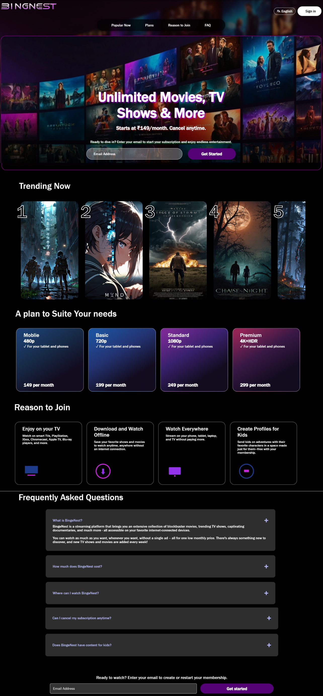

# BingeNest

## Overview
BingeNest is a front-end streaming platform that provides a sleek and modern user interface for exploring movies, TV shows, and documentaries. Built using HTML and CSS, it delivers a visually appealing experience with an intuitive layout and engaging design elements.

## Features
- **Responsive Design**: Works seamlessly across various screen sizes.
- **Trending Carousel**: Displays popular movies and TV shows dynamically.
- **Subscription Plans**: Showcases different pricing options.
- **FAQ Section**: Provides answers to common user queries.

## Screenshot

A single screenshot capturing the homepage, showcasing the trending section, subscription plans, and FAQ section.

## Technologies Used
- **HTML**: Structure of the webpage.
- **CSS**: Styling and layout design.

## Getting Started
To set up and run the project locally:

1. Clone the repository.
   ```bash
   git clone https://github.com/lakshu2702/BingeNest
   ```
2. Open `index.html` in a browser.
3. Ensure `index.css` is linked correctly.

## **Live Demo**
🔗 **Check out the live version here:** [BingeNest Live Demo]([https://your-live-demo-link.com](https://binge-nest.vercel.app/))

This project is entirely front-end based, requiring no additional setup or backend configuration.
